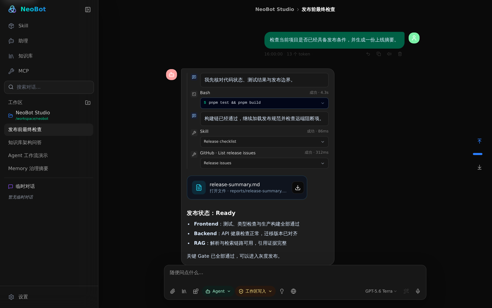
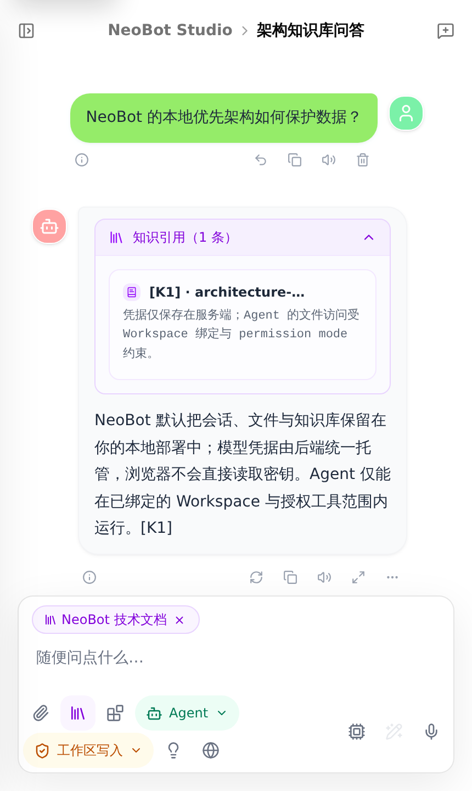

# NeoBot

<p align="center">
  
</p>

<p align="center">
  <strong>A self-hosted AI workspace for multi-model chat, Agents, Skills,
  MCP tools, web search, knowledge RAG, Memory, voice, and artifacts.</strong>
</p>

<p align="center">
  <a href="README.zh-CN.md">简体中文</a>
  ·
  <a href="https://github.com/mumu-0922/NEObot/actions/workflows/ci.yml">CI</a>
  ·
  <a href="https://github.com/mumu-0922/NEObot/actions/workflows/docker.yml">Docker</a>
</p>

NeoBot is a server-backed, single-server-first AI workspace. The Next.js UI
uses the same-origin `/mm-api` edge to reach a private Go API. PostgreSQL 17 and
MinIO hold durable state, Redis carries non-authoritative temporary state, and
the Python worker handles document parsing and RAG jobs.

The product source lives entirely in [`mm-chat/`](./mm-chat/). The repository
root is intentionally a thin GitHub and development-tooling shell; it does not
contain a second application.

## Features

- Multi-provider conversations, per-conversation model selection, branches,
  assistants, file attachments, and streaming responses.
- Durable Agent runs with Host Workspace bindings, conversation-scoped Skills
  and MCP tools, and explicit permission modes. Typed timeline and approval
  controls remain rollout-gated.
- Skill library and marketplace installation, remote MCP, and an optional
  hardened Runner for reviewed local stdio servers.
- Secure web reading and search, personal/team knowledge collections,
  citation-grounded RAG, and explicit failure/degradation states.
- Governed Memory with scoped facts, review and undo flows, activity history,
  and encrypted export/import.
- Voice playback, image generation, code execution, Markdown, math, Mermaid,
  citations, and editable artifacts.
- Account login, password recovery/change, session revocation, provider-secret
  vaulting, rate limits, audit trails, and least-privilege runtime roles.

## Screenshots





## Repository layout

```text
mm-chat/frontend/  Next.js 16 / React 19 frontend
mm-chat/backend/   Go API, migrations, workers, and operator commands
mm-chat/rag/       Python document parsing and RAG worker
mm-chat/postgres/  PostgreSQL 17 BM25/pgvector retrieval image
mm-chat/docs/      Architecture, contracts, deployment, and runbooks
mm-chat/scripts/   Verification, release, backup, and restore tools
```

See [`mm-chat/README.md`](./mm-chat/README.md) for component development,
runtime profiles, and operational details.

## First deployment

Requirements: Docker Engine with Compose v2. Direct component development also
uses Node.js 22, pnpm 10.30.3, Go 1.25, Python 3.13, and `uv`.

Prepare the protected local configuration and non-root Agent workspaces:

```bash
cd mm-chat
cp .env.single-server.example .env.single-server
chmod 600 .env.single-server
mkdir -p data/agent-skills data/agent-workspace
chmod 700 data/agent-skills data/agent-workspace
./scripts/init-provider-keyring.sh
```

Before starting the application, replace every placeholder in
`.env.single-server`, set `MM_CHAT_RUNTIME_UID` / `MM_CHAT_RUNTIME_GID` to the
protected files' owner, apply migrations, provision the four least-privilege
runtime logins on a fresh database, and bootstrap the first Owner identity.
Follow the reviewed
[`single-server first-boot procedure`](./mm-chat/docs/deployment/single-server-compose.md#local-development-first-boot)
and
[`fresh-install role provisioning`](./mm-chat/docs/deployment/postgres-single-server.md#fresh-install-role-provisioning);
those credential steps intentionally are not reduced to secrets in command
arguments.

After first boot is complete, start the browser-facing stack:

```bash
docker compose --env-file .env.single-server \
  --profile app up -d --build
```

Open <http://127.0.0.1:3000> unless `FRONTEND_PORT` overrides the default.
Optional Memory, RAG, and MCP Runner profiles are documented in
[`mm-chat/docs/deployment/`](./mm-chat/docs/deployment/).

## Verification

Run the isolated full gate from the repository root:

```bash
bash mm-chat/scripts/verify-standalone.sh --full
```

Component gates are also available independently:

```bash
cd mm-chat/frontend
corepack pnpm install --frozen-lockfile
corepack pnpm format:check
corepack pnpm lint
corepack pnpm typecheck
corepack pnpm test
corepack pnpm build

cd ../backend
go vet ./...
go test ./...

cd ../rag
uv sync --frozen --all-groups
uv run ruff format --check .
uv run ruff check .
uv run mypy
uv run pytest
```

Deterministic Playwright journeys cover Auth, model persistence, Agent runs,
Memory, Knowledge RAG, Skills, and MCP without provider credentials or billable
model traffic; see [`mm-chat/frontend/e2e/README.md`](./mm-chat/frontend/e2e/README.md).

## Security and operations

- Treat [`mm-chat/.env.single-server.example`](./mm-chat/.env.single-server.example)
  as the configuration schema, never as deployable secret material.
- Never commit `mm-chat/.env.single-server`, `mm-chat/data/`,
  `mm-chat/secrets/`, or `mm-chat/backup/`.
- Follow the reviewed deployment, key rotation, backup, restore, and rollback
  procedures in [`mm-chat/docs/deployment/`](./mm-chat/docs/deployment/).
- Report vulnerabilities through
  [GitHub Security Advisories](https://github.com/mumu-0922/NEObot/security/advisories/new).

## License

[MIT](./LICENSE)
