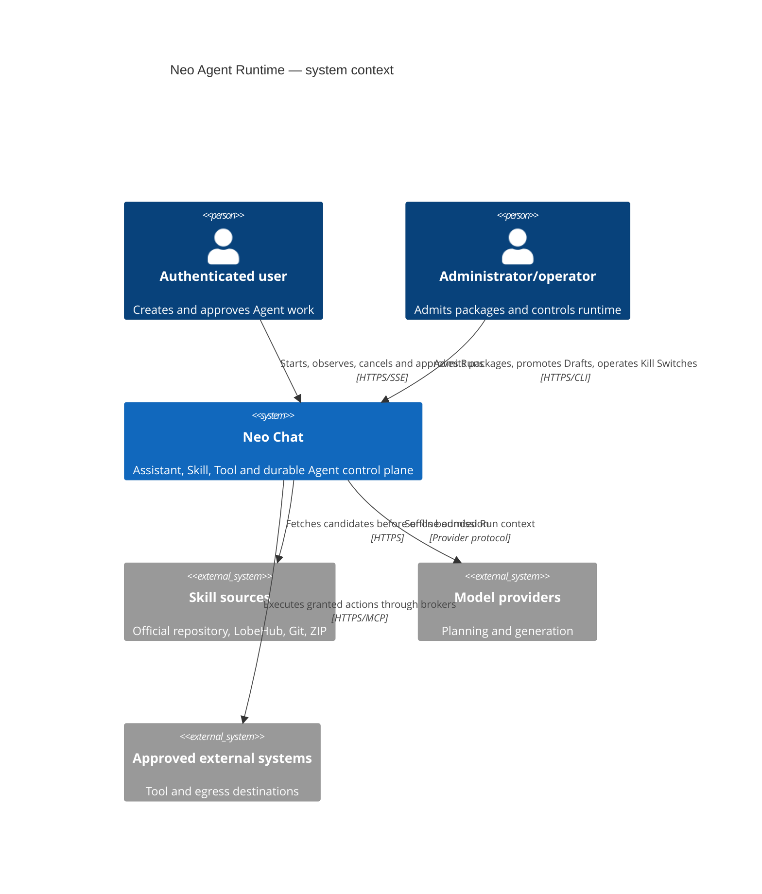
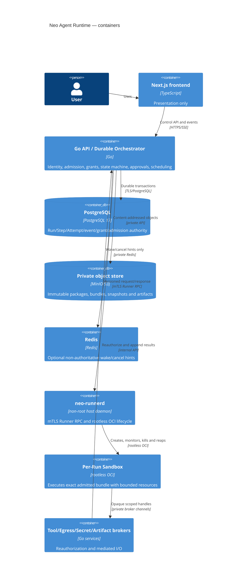
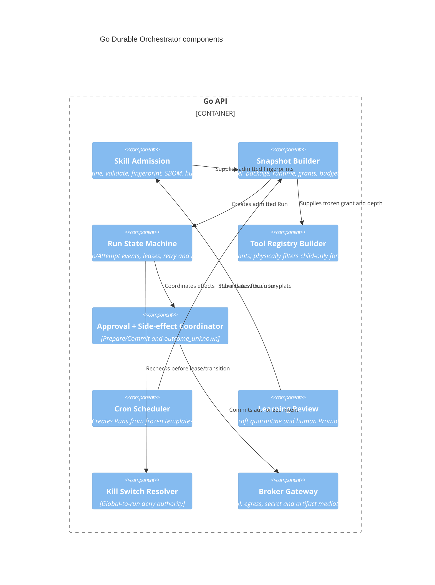

# Neo Agent Runtime Architecture

Status: G20.1 no-execute Skill supply chain, G20.2 durable Orchestrator, G20.3
Runner, G20.4 brokered effects and G20.5 depth-1 Child delegation
source/control foundations implemented. Exact-host isolation, production relay
and Child execution promotion are held; production Runtime remains disabled.

## Purpose and invariant

Neo Chat will support package-based Skills, durable Agent runs, one-level
delegation, scheduled work and review-gated learning without granting a model,
Skill package or Sandbox direct authority over the host. The invariant is:

```text
model proposes; Control Plane authorizes; Runner isolates; Broker mediates;
PostgreSQL records; operator promotes.
```

Assistant, Skill and Tool remain separate:

| Product concept | Owns | Must not own |
| --- | --- | --- |
| Assistant | model/prompt preset and presentation metadata | executable bytes, Tool grants, secrets |
| Skill | admitted instruction/runtime package and requested capabilities | effective authorization or credentials |
| Tool | callable action contract and executor | Assistant identity or implicit Skill installation |

The Agent Runtime composes immutable snapshots of all three; it does not merge
their stores or let one silently install/enable another.

## C4 — Context



Skill sources and every artifact they return are untrusted. Model output and
Tool results are untrusted data even when they came from an admitted package.

## C4 — Containers



No browser-to-Runner, browser-to-Sandbox or Sandbox-to-database/object-store
path exists. `neo-runnerd` has no browser bearer, Provider vault, PostgreSQL,
Redis, MinIO/S3 or Docker socket credential.

## C4 — Control-plane components



## ArchiMate cross-layer blueprint

| Layer | Elements | Contract joining the next layer |
| --- | --- | --- |
| Business | start/cancel Run, approve effect, admit Skill, promote Draft, manage Cron, emergency stop | authenticated actor, ownership, explicit decision and audit event |
| Application | Agent API, Admission, Orchestrator, Scheduler, Approval, Registry Builder, Brokers | immutable Run snapshot plus server-issued Capability Grant |
| Data | package/runtime/SBOM objects, Run/Step/Attempt/event ledger, Workspace snapshot, Artifacts | content fingerprints, sequence, lease generation and owner binding |
| Technology | Go/PostgreSQL/MinIO, non-root `neo-runnerd`, rootless OCI, cgroup v2, seccomp, broker network | mTLS RPC, runtime probe fingerprint and Isolation Acceptance evidence |

Business authorization never becomes an OCI option directly. Application
policy must first materialize a frozen, auditable launch envelope; Technology
enforcement accepts only that envelope and cannot widen it.

## End-to-end run flow

1. Backend authenticates the user and resolves current Project, Assistant,
   installed admitted Skills, Tool availability and model capability.
2. Snapshot Builder intersects current policy with requested permissions and
   freezes fingerprints, model, token/time/artifact budgets, Egress, Secret
   refs, Workspace snapshot and lineage.
3. PostgreSQL transaction appends `pending -> admitted -> queued`; Redis may
   emit an ID-only wake hint after commit.
4. A worker leases one Attempt with a monotonically increasing generation.
5. Kill Switch and current revoke/expiry state are rechecked. Backend sends an
   mTLS `launch` request carrying the exact lease and snapshot fingerprints.
6. `neo-runnerd` revalidates the runtime probe and creates a fresh rootless OCI
   Sandbox. It mounts immutable package/runtime data read-only, the Project
   snapshot through a controlled workspace boundary, and per-Run Scratch.
7. Model/Sandbox requests reach a Broker. Each call is checked against the
   frozen grant and current kill/revoke/lease state. Package declarations or
   Tool output cannot expand the registry.
8. Read-only effects may complete directly. Mutable/external effects follow
   Prepare/Commit. Ambiguous Commit acknowledgement becomes `outcome_unknown`.
9. Runner streams bounded output/events with sequence/backpressure. Backend
   publishes accepted Artifacts through object storage and records fingerprints.
10. Terminal state kills/reaps the full process/cgroup, destroys Scratch and
    releases leases. Retention/cleanup continues even when Runtime is disabled.

## Durable authority and recovery

- PostgreSQL is the only Run/Step/Attempt transition and lease authority.
- Events are append-only. Current state is a transactionally maintained
  projection; rebuilding it from events must yield the same terminal state.
- Attempt lease generation is included in every Runner RPC and side-effect
  operation. Reclaim creates a higher generation; the old Attempt can only be
  killed/reaped and cannot publish output, Artifact or Commit.
- Runner restart reconciles known Sandboxes with live leases. Unknown Sandbox,
  stale lease or snapshot mismatch is killed fail closed.
- Orchestrator restart replays nonterminal events, expires stale leases and
  queries Runner by exact Attempt ID. It never infers an external write did not
  happen merely because acknowledgement is missing.
- Redis loss delays wake/cancel hints only; PostgreSQL polling and current Kill
  Switch state remain authoritative.

## Skill supply chain

```text
source metadata
  -> bounded fetch quarantine
  -> archive/path/type/size validation
  -> Agent Skills SKILL.md validation
  -> Neo Manifest validation
  -> dependency resolution to immutable digests
  -> package fingerprint + runtime bundle fingerprint + SBOM
  -> static/dynamic isolation validation
  -> human admission
  -> immutable install reference
```

The admission service rejects path traversal, absolute archive paths, symlink
or hardlink escape, devices/FIFOs/sockets, Unicode/path collisions, duplicate
canonical paths, compression bombs, floating Git refs/tags, floating package or
image versions, unknown executables, inline secrets and mismatched fingerprints.
Archive extraction never occurs in the Backend working tree.

`SKILL.md` follows Agent Skills. `allowed-tools` is a requested-intent hint only.
`neo.runtime.json` declares the runtime surface under
[`neo-skill-runtime-manifest.schema.json`](../contracts/schemas/neo-skill-runtime-manifest.schema.json).
It does not contain source/admission coordinates or its own package, runtime or
SBOM fingerprints: those are server-derived envelope fields, avoiding a
self-referential hash while keeping the complete manifest bytes inside package
identity.
Neither file is executable authority before admission and grant resolution.

## Storage model

| Plane | Sandbox view | Write path | Lifecycle |
| --- | --- | --- | --- |
| Project Workspace | frozen snapshot, read-only by default | bounded patch intent, authorization and conflict check | durable project authority; never direct host bind |
| Scratch | private read/write filesystem | local to exact Run/cgroup | destroyed on terminal, kill or orphan reconcile |
| Artifact | no storage credential | stream to Artifact Broker, scan, quota, owner bind, content hash | backend/object-store retention and deletion |

Project writes are side effects and follow Prepare/Commit. Artifact publication
does not imply Project mutation. An Artifact containing a secret or unsafe type
is quarantined/rejected and never silently attached to chat.

## Brokered effect authority

G20.4 implements the held control foundation in
`backend/internal/agentbroker/` and migration `086`:

- the Tool Registry is a deterministic intersection of the current server
  catalog, admitted package declarations and frozen Capability Grant;
- depth-1 forbidden Tools are physically removed before the Registry
  fingerprint is computed;
- PostgreSQL owns immutable intents, append-only approval decisions, one Commit
  claim, sanitized receipts, budgets and secret-handle digests;
- Prepare binds the current subject, snapshot, grant, registry, lease token
  digest, Kill Switch epoch, canonical arguments and expiry without performing
  a mutable effect;
- Commit rechecks those fences and returns the original terminal receipt on an
  exact replay. A possibly dispatched write without an exact status proof ends
  as `outcome_unknown` and is never blindly retried;
- Agent Egress and MCP reuse `backend/internal/safenet` for dial-time DNS/IP and
  redirect policy. Agent allowlists additionally require exact HTTPS origins
  and reject IP literals;
- Secret values and plaintext handles stay process-memory-only until one bound
  consume; durable state contains only digests and sanitized bindings, and
  issuance/consume recheck the exact committing intent, lease and Kill Switch;
- Project mutation is represented only by a bounded patch interface and
  deterministic CAS test fake because no production Project file store exists;
- Artifact publication rechecks exact quarantine size and SHA-256 over the same
  bounded bytes it scans, then uses object-before-row ordering and compensating
  object deletion. It never implies a Project write.

`neo-runnerd` validates and replay-fences strict `prepare` and `commit` relay
messages but its default injected relay returns `RUNTIME_UNAVAILABLE`. The
Runner still owns no database, vault, object-store or MCP credential. There is
no public Agent route, Chat/frontend integration, startup worker, production
Project mutation or live mutable executor wiring in this group.

## Delegation

G20.5 implements the held control foundation in
`backend/internal/agentdelegation/`, migration `087`, the shared Broker Registry
builder and Runner launch-lineage validation:

- Root Run depth is `0`; Child Run depth is exactly `1`; no other depth validates.
- PostgreSQL stores immutable root/child authority and the exact live Parent
  Attempt generation, lease owner and token digest. A Parent proposal cannot
  supply its own authenticated user identity, effective Child snapshot, Grant
  or Registry.
- Backend creates an independent durable Child Run only after deriving a strict
  subset snapshot; PostgreSQL repeats the decisive subset, lease, expiry, Kill
  Switch and reservation checks in the enqueue transaction.
- Child package/runtime fingerprints must already be admitted and selected by
  Parent authority. Subject and model are exact Parent bindings; capabilities,
  actions/resources, approval, Egress, Secrets, expiry and all four budgets may
  only narrow. Concurrent reservations serialize on the Parent account.
- Child Tool Registry is constructed from the Parent intersection, then an
  unconditional forbidden set removes `delegate_task`, `cron_manage`,
  `grant_manage`, `secret_manage` and `runtime_manage` before fingerprinting.
- A retained Tool identity preserves the Parent capability, classification and
  idempotency class; actions, resource selectors, approval and call limits only
  narrow. PostgreSQL prefix checks are literal rather than wildcard matches.
- Schema validation, Registry Builder, PostgreSQL launch admission and Runner
  validation all enforce depth/lineage/fingerprint/identity binding. A prompt or
  runtime error alone is not a security control.
- Parent cancellation/kill fences Child leases and terminalizes Child
  Attempt/Step/Run projections before invoking an injected reaper. Failure stays
  durable and retryable; reconciliation discovers terminal, expired, reclaimed
  or Kill-Switched Parents and never restores a fenced lease.

No public delegation API, Chat/frontend integration, startup worker or
production Child-to-Runner call exists in G20.5. The current host remains
`ISOLATION_UNAVAILABLE`.

## Cron and learning

A Cron template freezes owner, schedule/timezone, input/prompt, model, budget,
Skill/package/runtime fingerprints, grants, Egress and Secret references. Each
trigger still rechecks owner status, revocation, expiry, admission and Kill
Switches; a failure creates a sanitized skipped/denied execution fact. Later
grant expansion never enlarges an existing template. Any edited template gets a
new revision and explicit approval.

Learning may create a quarantined Draft containing proposed `SKILL.md`, Neo
Manifest, tests and provenance evidence. Automated checks may reject or mark it
reviewable; only an authenticated human Promote can create a new admitted
fingerprint. Promote never rewrites an installed version, live Run or Cron
snapshot.

## Trust boundaries and STRIDE

| Boundary / threat | STRIDE | Control and required proof |
| --- | --- | --- |
| browser -> API identity spoof | S/R | existing bearer/session authority, owner recheck, immutable audit actor |
| source -> quarantine package tamper | T/E | exact source pin, canonical hash, SBOM, admission signature, immutable object |
| model/Skill -> grant expansion | T/E | server-only Grant, strict intersection, unknown fields denied |
| API -> Runner replay/spoof | S/T/R | mTLS identity, protocol version, nonce TTL, request ID and durable replay fence |
| stale Attempt -> side effect | T/E | lease generation on every Prepare/Commit; old generation denied |
| Sandbox -> host escape | E/I | rootless userns, non-root daemon, no caps, seccomp, cgroup, no socket/bind, negative escape suite |
| Sandbox -> secret disclosure | I | action-bound Broker handle, short TTL, redaction and zero persistence tests |
| Sandbox -> network bypass | I/E | none/brokered network, DNS/IP/redirect checks, metadata/link-local denial |
| output/artifact resource exhaustion | D | byte/file/PID/memory/CPU/wall limits, streaming backpressure and quota |
| cancellation vs Commit ambiguity | R/T | Prepare/Commit event ledger, idempotency receipt, `outcome_unknown` precedence |
| Grant revoked while Secret bytes are memory-resident | I/E | append-only revocation, durable handle revoke and control-service in-memory zeroization |
| Child recursive delegation | E/D | max depth 1 plus physical Tool removal and launch rejection fixture |
| operator/Runtime kill denial | D/R | hierarchical durable Kill Switch, terminal event and process-group/cgroup reap |
| learning modifies live Skill | T/E | Draft quarantine, human Promote, new fingerprint, snapshot immutability |

## Kill Switch hierarchy

Most-specific allow never overrides a broader deny. Resolution order is:

```text
global Runtime
  -> scheduler/Cron
  -> runner/host
  -> source/admission
  -> Skill fingerprint
  -> Tool/capability/action
  -> Egress destination
  -> Secret reference
  -> Project/user
  -> Run
```

`deny_new` blocks admission/leases while current read-only cleanup may finish;
`cancel` requests cooperative stop; `kill` fences leases and terminates the
Sandbox/cgroup. Mutable Commit is never allowed after any applicable switch is
active. Cleanup, retention, orphan reap and reconciliation remain enabled.

## Observability boundary

Allowed durable facts: stable IDs, fingerprints, state, sequence, lease
generation, bounded reason/error class, byte/call/token counts, duration,
approval class and low-cardinality runtime/transport outcome.

Forbidden in logs/metrics/events: prompt or Skill bodies, Workspace contents,
Tool arguments/results, raw stdout/stderr, Artifact bytes, Secret handles or
values, auth headers, custom URL paths, provider payloads and high-cardinality
user/Skill labels. User-visible process traces are separately sanitized and do
not reveal private chain-of-thought.

## Migration and rollback boundary

G20.1 adds Skill supply/API/persistence, G20.2 adds the internal durable
Orchestrator, G20.3 adds the credential-free host Runner boundary, G20.4 adds
the held Tool Registry and brokered-effect authority, and G20.5 adds held
depth-1 lineage, reservation, launch-admission and reap authority. G20.3
implements strict TLS 1.3 mTLS RPC, PostgreSQL plus local-fsync replay fences,
release probing, one rootless Podman Sandbox per Attempt, full Workspace
revalidation, bounded tmpfs Scratch, exact kill/reap/reconcile and local Unix
Artifact quarantine. The release manifest remains unapproved and the current
host returns `ISOLATION_UNAVAILABLE`; no API/Chat startup path imports it.
G20.4 adds migration `086`, shared safe-network enforcement and strict
Prepare/Commit relay shapes, but leaves the production relay and all mutations
unwired. G20.5 adds migration `087` and a signed Runner `runLineage`, but no
production Child launch path. None of these groups changes Chat or legacy
text-Skill behavior; existing pure-text Skills remain untouched through G20.8
and are deleted only by G20.9.
The future final cutover:

1. freezes new legacy Skill installation/editing;
2. captures a rollback inventory/backup without converting legacy content;
3. requires new Runtime clean-copy, restart, isolation, kill and rollback proof;
4. removes `installedSkills`, `customSkills`, `activeSkillIds`,
   `skillAutoSelect`, Conversation/Workspace `activeSkills`, browser Skill
   selection/context assembly and old catalog state;
5. retains only a read-only “旧版技能已退役” projection for historical
   `skillInvocations`, without retaining executable legacy Skill definitions;
6. switches server authority once, then prefers forward fix. A rollback may
   restore the prior application image and backup only inside the declared
   rollback window; it must not partially mix legacy and new execution.

The current `/v1/code/executions` remains fail closed. Agent Runtime must not use
that placeholder route as an isolation shortcut.

## Promotion gates

Production execution remains disabled until later groups prove:

- current host passes the rootless capability probe;
- exact release `neo-runnerd`, runtime bundle and seccomp fingerprints pass the
  Isolation Acceptance Suite;
- Run/Step/Attempt and Prepare/Commit recovery pass disposable PostgreSQL and
  crash/restart matrices;
- Child registry and launch admission reject recursion;
- secret/network/workspace/artifact boundaries pass negative tests;
- Kill Switches kill/reap exact Sandboxes without stopping cleanup;
- clean-copy, backup/restore and rollback rehearsals pass.

See [the executable contract](../contracts/agent-runtime.md),
[operations guide](../deployment/agent-runtime.md) and
[G20 sliced plan](../tracking/g20-agent-runtime-plan.md).
