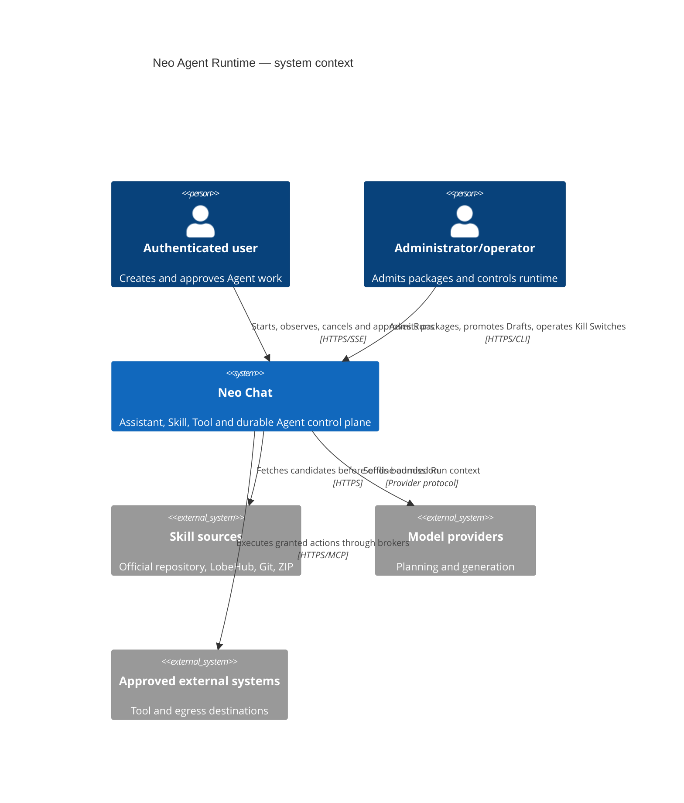
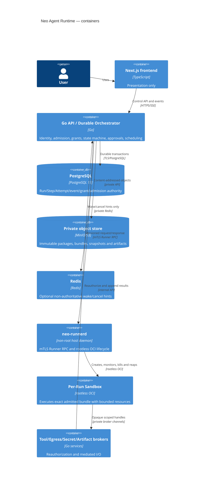
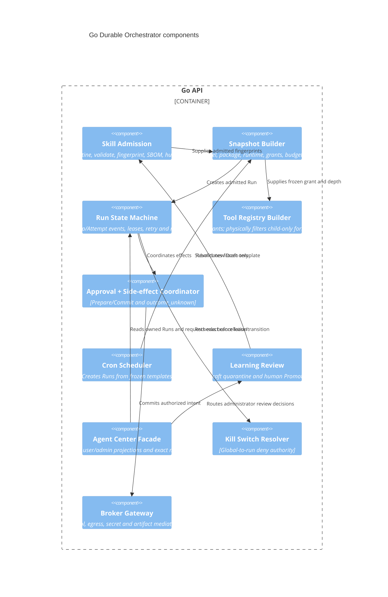

# Neo Agent Runtime Architecture

Status: G20.1 no-execute Skill supply chain, G20.2 durable Orchestrator, G20.3
Runner, G20.4 brokered effects, G20.5 depth-1 Child delegation, G20.6 durable
Cron scheduling, G20.7 Draft-only learning, the G20.8 Agent Center/default-off
Shadow control plane, and G20.9 legacy text-Skill hard retirement are
implemented. G20.10 adds the fail-closed operations policy and release-bound
promotion-evidence gate. Exact-host isolation and production Runner/Broker/
Child/Scheduler/Learning/Shadow promotion are held; production Runtime remains
disabled and no legacy/fallback Skill executor remains. G21.0 implements the
default-off maintenance plane; G21.1 implements a separately activated,
synthetic-only Root Run canary. G21.2 implements a third default-off canary
that reaches the durable Broker only through the Runner relay for five reviewed
synthetic actions, including bounded Artifact publication, without enabling
general or user-facing execution. G21.3 adds a fourth independently activated
canary for one offline-approved synthetic Project compare-and-swap mutation;
generic mutation, MCP writes and user Projects remain unavailable.

## Purpose and invariant

Neo Chat will support package-based Skills, durable Agent runs, one-level
delegation, scheduled work and review-gated learning without granting a model,
Skill package or Sandbox direct authority over the host. The invariant is:

```text
model proposes; Control Plane authorizes; Runner isolates; Broker mediates;
PostgreSQL records; operator promotes.
```

Assistant, Skill and Tool remain separate:

| Product concept | Owns | Must not own |
| --- | --- | --- |
| Assistant | model/prompt preset and presentation metadata | executable bytes, Tool grants, secrets |
| Skill | admitted instruction/runtime package and requested capabilities | effective authorization or credentials |
| Tool | callable action contract and executor | Assistant identity or implicit Skill installation |

The Agent Runtime composes immutable snapshots of all three; it does not merge
their stores or let one silently install/enable another.

## C4 — Context



Skill sources and every artifact they return are untrusted. Model output and
Tool results are untrusted data even when they came from an admitted package.

## C4 — Containers



No browser-to-Runner, browser-to-Sandbox or Sandbox-to-database/object-store
path exists. `neo-runnerd` has no browser bearer, Provider vault, PostgreSQL,
Redis, MinIO/S3 or Docker socket credential.

## C4 — Control-plane components



## ArchiMate cross-layer blueprint

| Layer | Elements | Contract joining the next layer |
| --- | --- | --- |
| Business | start/cancel Run, approve effect, admit Skill, promote Draft, manage Cron, emergency stop | authenticated actor, ownership, explicit decision and audit event |
| Application | Agent API, Admission, Orchestrator, Scheduler, Approval, Registry Builder, Brokers | immutable Run snapshot plus server-issued Capability Grant |
| Data | package/runtime/SBOM objects, Run/Step/Attempt/event ledger, Workspace snapshot, Artifacts | content fingerprints, sequence, lease generation and owner binding |
| Technology | Go/PostgreSQL/MinIO, non-root `neo-runnerd`, rootless OCI, cgroup v2, seccomp, broker network | mTLS RPC, runtime probe fingerprint and Isolation Acceptance evidence |

Business authorization never becomes an OCI option directly. Application
policy must first materialize a frozen, auditable launch envelope; Technology
enforcement accepts only that envelope and cannot widen it.

## End-to-end run flow

1. Backend authenticates the user and resolves current Project, Assistant,
   installed admitted Skills, Tool availability and model capability.
2. Snapshot Builder intersects current policy with requested permissions and
   freezes fingerprints, model, token/time/artifact budgets, Egress, Secret
   refs, Workspace snapshot and lineage.
3. PostgreSQL transaction appends `pending -> admitted -> queued`; Redis may
   emit an ID-only wake hint after commit.
4. A worker leases one Attempt with a monotonically increasing generation.
5. Kill Switch and current revoke/expiry state are rechecked. Backend sends an
   mTLS `launch` request carrying the exact lease and snapshot fingerprints.
6. `neo-runnerd` revalidates the runtime probe and creates a fresh rootless OCI
   Sandbox. It mounts immutable package/runtime data read-only, the Project
   snapshot through a controlled workspace boundary, and per-Run Scratch.
7. Model/Sandbox requests reach a Broker. Each call is checked against the
   frozen grant and current kill/revoke/lease state. Package declarations or
   Tool output cannot expand the registry.
8. Read-only effects may complete directly. Mutable/external effects follow
   Prepare/Commit. Ambiguous Commit acknowledgement becomes `outcome_unknown`.
9. Runner streams bounded output/events with sequence/backpressure. Backend
   publishes accepted Artifacts through object storage and records fingerprints.
10. Terminal state kills/reaps the full process/cgroup, destroys Scratch and
    releases leases. Retention/cleanup continues even when Runtime is disabled.

## Durable authority and recovery

- PostgreSQL is the only Run/Step/Attempt transition and lease authority.
- Events are append-only. Current state is a transactionally maintained
  projection; rebuilding it from events must yield the same terminal state.
- Attempt lease generation is included in every Runner RPC and side-effect
  operation. Reclaim creates a higher generation; the old Attempt can only be
  killed/reaped and cannot publish output, Artifact or Commit.
- Runner restart reconciles known Sandboxes with live leases. Unknown Sandbox,
  stale lease or snapshot mismatch is killed fail closed.
- Orchestrator restart replays nonterminal events, expires stale leases and
  queries Runner by exact Attempt ID. It never infers an external write did not
  happen merely because acknowledgement is missing.
- Redis loss delays wake/cancel hints only; PostgreSQL polling and current Kill
  Switch state remain authoritative.

## Skill supply chain

```text
source metadata
  -> bounded fetch quarantine
  -> archive/path/type/size validation
  -> Agent Skills SKILL.md validation
  -> Neo Manifest validation
  -> dependency resolution to immutable digests
  -> package fingerprint + runtime bundle fingerprint + SBOM
  -> static/dynamic isolation validation
  -> human admission
  -> immutable install reference
```

The admission service rejects path traversal, absolute archive paths, symlink
or hardlink escape, devices/FIFOs/sockets, Unicode/path collisions, duplicate
canonical paths, compression bombs, floating Git refs/tags, floating package or
image versions, unknown executables, inline secrets and mismatched fingerprints.
Archive extraction never occurs in the Backend working tree.

`SKILL.md` follows Agent Skills. `allowed-tools` is a requested-intent hint only.
`neo.runtime.json` declares the runtime surface under
[`neo-skill-runtime-manifest.schema.json`](../contracts/schemas/neo-skill-runtime-manifest.schema.json).
It does not contain source/admission coordinates or its own package, runtime or
SBOM fingerprints: those are server-derived envelope fields, avoiding a
self-referential hash while keeping the complete manifest bytes inside package
identity.
Neither file is executable authority before admission and grant resolution.

## Storage model

| Plane | Sandbox view | Write path | Lifecycle |
| --- | --- | --- | --- |
| Project Workspace | frozen snapshot, read-only by default | bounded patch intent, authorization and conflict check | durable project authority; never direct host bind |
| Scratch | private read/write filesystem | local to exact Run/cgroup | destroyed on terminal, kill or orphan reconcile |
| Artifact | no storage credential | stream to Artifact Broker, scan, quota, owner bind, content hash | backend/object-store retention and deletion |

Project writes are side effects and follow Prepare/Commit. Artifact publication
does not imply Project mutation. An Artifact containing a secret or unsafe type
is quarantined/rejected and never silently attached to chat.

## Brokered effect authority

G20.4 implements the held control foundation in
`backend/internal/agentbroker/` and migration `086`:

- the Tool Registry is a deterministic intersection of the current server
  catalog, admitted package declarations and frozen Capability Grant;
- depth-1 forbidden Tools are physically removed before the Registry
  fingerprint is computed;
- PostgreSQL owns immutable intents, append-only approval decisions, one Commit
  claim, sanitized receipts, budgets and secret-handle digests;
- Prepare binds the current subject, snapshot, grant, registry, lease token
  digest, Kill Switch epoch, canonical arguments and expiry without performing
  a mutable effect;
- Commit rechecks those fences and returns the original terminal receipt on an
  exact replay. A possibly dispatched write without an exact status proof ends
  as `outcome_unknown` and is never blindly retried;
- Agent Egress and MCP reuse `backend/internal/safenet` for dial-time DNS/IP and
  redirect policy. Agent allowlists additionally require exact HTTPS origins
  and reject IP literals;
- Secret values and plaintext handles stay process-memory-only until one bound
  consume; durable state contains only digests and sanitized bindings, and
  issuance/consume recheck the exact committing intent, lease and Kill Switch;
- Project mutation is represented only by a bounded patch interface and
  deterministic CAS test fake because no production Project file store exists;
- Artifact publication rechecks exact quarantine size and SHA-256 over the same
  bounded bytes it scans, then uses object-before-row ordering and compensating
  object deletion. It never implies a Project write.

`neo-runnerd` validates and replay-fences strict `prepare` and `commit` relay
messages but its default injected relay returns `RUNTIME_UNAVAILABLE`. The
Runner still owns no database, vault, object-store or MCP credential. There is
no public Agent route, Chat/frontend integration, startup worker, production
Project mutation or live mutable executor wiring in this group.

## Delegation

G20.5 implements the held control foundation in
`backend/internal/agentdelegation/`, migration `087`, the shared Broker Registry
builder and Runner launch-lineage validation:

- Root Run depth is `0`; Child Run depth is exactly `1`; no other depth validates.
- PostgreSQL stores immutable root/child authority and the exact live Parent
  Attempt generation, lease owner and token digest. A Parent proposal cannot
  supply its own authenticated user identity, effective Child snapshot, Grant
  or Registry.
- Backend creates an independent durable Child Run only after deriving a strict
  subset snapshot; PostgreSQL repeats the decisive subset, lease, expiry, Kill
  Switch and reservation checks in the enqueue transaction.
- Child package/runtime fingerprints must already be admitted and selected by
  Parent authority. Subject and model are exact Parent bindings; capabilities,
  actions/resources, approval, Egress, Secrets, expiry and all four budgets may
  only narrow. Concurrent reservations serialize on the Parent account.
- Child Tool Registry is constructed from the Parent intersection, then an
  unconditional forbidden set removes `delegate_task`, `cron_manage`,
  `grant_manage`, `secret_manage` and `runtime_manage` before fingerprinting.
- A retained Tool identity preserves the Parent capability, classification and
  idempotency class; actions, resource selectors, approval and call limits only
  narrow. PostgreSQL prefix checks are literal rather than wildcard matches.
- Schema validation, Registry Builder, PostgreSQL launch admission and Runner
  validation all enforce depth/lineage/fingerprint/identity binding. A prompt or
  runtime error alone is not a security control.
- Parent cancellation/kill fences Child leases and terminalizes Child
  Attempt/Step/Run projections before invoking an injected reaper. Failure stays
  durable and retryable; reconciliation discovers terminal, expired, reclaimed
  or Kill-Switched Parents and never restores a fenced lease.

No public delegation API, Chat/frontend integration, startup worker or
production Child-to-Runner call exists in G20.5. The current host remains
`ISOLATION_UNAVAILABLE`.

## Cron and learning

G20.6 implements the held Cron control foundation in
`backend/internal/agentcron/` and migration `088`. Go pins
`robfig/cron/v3@v3.0.1`, accepts only standard five-field expressions, loads the
separately frozen IANA timezone from embedded `tzdata`, and calculates bounded
occurrences. Spring-forward gaps are skipped; both distinct UTC instants in a
fall-back overlap are retained.

A logical template owns only lifecycle, the active revision, exact next cursor
and lease. Each immutable revision freezes owner, input reference/fingerprint,
schedule/timezone/calculator, model, four budgets, exact Skill installation,
admission, package/runtime, Grant and Registry fingerprints/capabilities,
Egress, Secret refs, expiry, steps/scopes and policies. It carries an append-only
approval class of `automation_read_only` or `automation_brokered_effect`; the
latter authorizes Run creation only and never bypasses per-effect
Prepare/Commit. Later Grant, Skill or model expansion never enlarges an existing
revision.

PostgreSQL owns cursor and occurrence claims fenced by owner, generation and
expiry. Occurrence identity is `template + revision + scheduled UTC instant`.
Missed work is bounded to `skip`, `fire_once` or at most 100 `catch_up` Runs in
24 hours; overlap is `skip`, `buffer_one` or `allow`. Trigger-to-normal-Run
enqueue and link commit atomically with the stable Cron idempotency identity.
Before enqueue, the locked transaction repeats current revision, owner, exact
Skill, Grant/approval revocation, expiry, Kill Switch and overlap checks. It
falls forward to no newer authority and records only a stable sanitized denial.

Pause stops materialization; resume advances beyond the current instant without
surprise backfill; delete tombstones until bounded cleanup. Retry applies only
before enqueue is proven and never retries an effect. No public Cron API,
frontend, Chat path, startup worker or production Scheduler invokes this held
foundation.

G20.7 implements the held Draft-only learning foundation in
`backend/internal/agentlearning/` and migration `089`. Only a same-user,
terminal `succeeded`, depth-0 Run whose frozen snapshot names the exact base
package may propose. The canonical Draft binds the source Run/snapshot, base
and proposed package, runtime/SBOM/archive, exact test inventory, changed paths
and bounded package/Run-event provenance. Prompt/input/output, Tool,
Secret/credential and Workspace bodies are forbidden from durable evidence.

The proposed archive must retain the same runtime image, entrypoints,
dependencies, `allowed-tools`, capability/Egress/Secret/resource authority and
limits; only the package version may change. Its bytes live under
`skill-drafts/sha256/`. A mismatched pre-existing content-addressed object is a
hard drift failure and is not overwritten.

Generation-fenced checking produces exactly one `static`, `isolation` and
`evaluation` receipt for the same immutable Draft. Policy failure terminalizes
the Draft; correction creates a new Draft instead of washing a score through
in-place retry. Only the configured authenticated administrator may Reject or
Promote. Promote refetches and rehashes bytes, reruns full Skill validation and
authority comparison, rechecks the exact receipts, source authority and Kill
Switches, writes canonical package/SBOM/quarantine objects, then atomically
creates a new admitted `learning` candidate/package. It never mutates an
installation, source Run/snapshot, Grant or Cron revision. Quarantine cleanup
is object-before-row and remains available while Learning is disabled.

No HTTP/UI/Chat/startup/Compose path or production isolation/evaluation adapter
is added in G20.7; the defaults remain `LEARNING_DISABLED` and
`CHECK_UNAVAILABLE`.

## Agent Center and held Shadow control

G20.8 adds an independent top-level Agent Center rather than merging package
Skills into Assistant Hub, MCP administration or the existing text-Skill
editor. Its Package Skills, Runs, Schedules and administrator-only Learning
Review tabs are URL-addressable and use one authenticated typed HTTP facade.
The browser receives only user-owned/admin-authorized projections. Artifact
metadata carries an authenticated download path; the object key stays inside
the Go service and object-store adapter.

The facade composes the existing Skill supply, Broker, Cron and Learning
services for mutations. It does not claim Runner/Scheduler/check-worker
identity, lease an Attempt, Commit an effect or write owning tables directly.
Run cancellation binds expected state and snapshot fingerprint; approval,
schedule lifecycle and Draft review retain their owning revision/fingerprint
fences. Invalid server DTOs fail as `INVALID_SERVER_RESPONSE` in the frontend.

Migration `090` owns the bounded product views, cancellation facts, Artifact
rows and default-off Shadow policy/opt-in/observation authority. Shadow admits
only `synthetic` and `read_only`, requires administrator policy plus explicit
user opt-in, and deterministically binds policy revision, user, admission and
package/runtime fingerprints. Boot epoch, generation, budget, expiry, opt-out,
Kill Switch and fingerprint drift fence stale work. Durable observations carry
only fingerprints, counts, latency buckets and stable reason codes; no prompt,
output, Tool, Secret or Artifact body is persisted or returned to Chat.

The production Shadow path remains held. The injected adapter seam can replay
synthetic contracts in tests, but no package code runs in the API or browser.
With exact-host isolation unavailable, the stable result is
`ISOLATION_UNAVAILABLE` and no executable work is scheduled. G20.8 also creates
a deterministic local legacy-Skill inventory, explicit raw local backup and
pure dry-run deletion plan. It deletes nothing; G20.9 owns the approved hard
deletion.

## Trust boundaries and STRIDE

| Boundary / threat | STRIDE | Control and required proof |
| --- | --- | --- |
| browser -> API identity spoof | S/R | existing bearer/session authority, owner recheck, immutable audit actor |
| source -> quarantine package tamper | T/E | exact source pin, canonical hash, SBOM, admission signature, immutable object |
| model/Skill -> grant expansion | T/E | server-only Grant, strict intersection, unknown fields denied |
| API -> Runner replay/spoof | S/T/R | mTLS identity, protocol version, nonce TTL, request ID and durable replay fence |
| stale Attempt -> side effect | T/E | lease generation on every Prepare/Commit; old generation denied |
| Sandbox -> host escape | E/I | rootless userns, non-root daemon, no caps, seccomp, cgroup, no socket/bind, negative escape suite |
| Sandbox -> secret disclosure | I | action-bound Broker handle, short TTL, redaction and zero persistence tests |
| Sandbox -> network bypass | I/E | none/brokered network, DNS/IP/redirect checks, metadata/link-local denial |
| output/artifact resource exhaustion | D | byte/file/PID/memory/CPU/wall limits, streaming backpressure and quota |
| cancellation vs Commit ambiguity | R/T | Prepare/Commit event ledger, idempotency receipt, `outcome_unknown` precedence |
| Grant revoked while Secret bytes are memory-resident | I/E | append-only revocation, durable handle revoke and control-service in-memory zeroization |
| Child recursive delegation | E/D | max depth 1 plus physical Tool removal and launch rejection fixture |
| stale/replayed Cron claim expands authority or duplicates a Run | T/E/D | immutable approved revision, generation fencing, UTC occurrence uniqueness, locked trigger-time recheck and stable Run idempotency |
| operator/Runtime kill denial | D/R | hierarchical durable Kill Switch, terminal event and process-group/cgroup reap |
| learning modifies live Skill | T/E | Draft quarantine, human Promote, new fingerprint, snapshot immutability |
| Shadow output becomes product or promotion authority | T/E/I | default-off policy plus opt-in, read-only capability, generation/fingerprint fences, content-free observations, no Chat injection |

## Kill Switch hierarchy

Most-specific allow never overrides a broader deny. Resolution order is:

```text
global Runtime
  -> scheduler/Cron
  -> runner/host
  -> source/admission
  -> Skill fingerprint
  -> Tool/capability/action
  -> Egress destination
  -> Secret reference
  -> Project/user
  -> Run
```

`deny_new` blocks admission/leases while current read-only cleanup may finish;
`cancel` requests cooperative stop; `kill` fences leases and terminates the
Sandbox/cgroup. Mutable Commit is never allowed after any applicable switch is
active. Cleanup, retention, orphan reap and reconciliation remain enabled.

## Observability boundary

Allowed durable facts: stable IDs, fingerprints, state, sequence, lease
generation, bounded reason/error class, byte/call/token counts, duration,
approval class and low-cardinality runtime/transport outcome.

Forbidden in logs/metrics/events: prompt or Skill bodies, Workspace contents,
Tool arguments/results, raw stdout/stderr, Artifact bytes, Secret handles or
values, auth headers, custom URL paths, provider payloads and high-cardinality
user/Skill labels. User-visible process traces are separately sanitized and do
not reveal private chain-of-thought.

G20.10 freezes the bounded metric names, label allowlist and page/ticket
thresholds in `config/agent-runner/production-policy.json`. A production record
hashes the external scrape and alert-routing proof; raw metrics/logs never enter
the record. `outcome_unknown`, readiness drift, Secret canary leakage, Kill
Switch enforcement failure and unreaped orphans are fail-closed page conditions.

## Migration and rollback boundary

G20.1 adds Skill supply/API/persistence, G20.2 adds the internal durable
Orchestrator, G20.3 adds the credential-free host Runner boundary, G20.4 adds
the held Tool Registry and brokered-effect authority, G20.5 adds held depth-1
lineage, reservation, launch-admission and reap authority, G20.6 adds held
immutable Cron revision, cursor/claim, occurrence and normal-Run enqueue
authority, G20.7 adds immutable Draft/check/decision/promotion/cleanup
authority, and G20.8 adds the authenticated Agent Center facade, Artifact seam,
default-off Shadow authority and inventory-only legacy preparation. G20.3
implements strict TLS 1.3 mTLS RPC, PostgreSQL plus local-fsync replay fences,
release probing, one rootless Podman Sandbox per Attempt, full Workspace
revalidation, bounded tmpfs Scratch, exact kill/reap/reconcile and local Unix
Artifact quarantine. The release manifest remains unapproved and the current
host returns `ISOLATION_UNAVAILABLE`; no API/Chat startup path imports it.
G20.4 adds migration `086`, shared safe-network enforcement and strict
Prepare/Commit relay shapes, but leaves the production relay and all mutations
unwired. G20.5 adds migration `087` and a signed Runner `runLineage`, but no
production Child launch path. G20.6 adds migration `088` and the isolated
`agentcron` package, but no public/startup Scheduler. G20.7 adds migration `089`
and the isolated `agentlearning` package, but no startup Learning worker or
executable checker. G20.8 adds `internal/agentcontrol`, migration `090` and the
top-level Agent Center, but no Runtime/Scheduler/learning-worker activation or
package executor. Migrations `088`, `089` and `090` have guarded rollback; the
narrow Cron and Learning control roles have SELECT plus exact function
execution and no table DML. The narrow product facade does not gain worker
claim/lease/Commit authority. None of these groups changes Chat execution
authority. Legacy pure-text Skills remain untouched in G20.8. G20.9 deletes
their browser authority and execution chain without adding a schema migration;
the PostgreSQL selection cleanup is the explicit operator cutover
`scripts/cutover-legacy-skills.sql`. G21.2 later adds migration `091` and G21.3
adds migration `092`; neither restores any legacy authority.
The G20.9 cutover:

1. freezes new legacy Skill installation/editing;
2. captures a rollback inventory/backup without converting legacy content;
3. keeps new Runtime execution held until clean-copy, restart, isolation, kill
   and rollback proof exists;
4. removes `installedSkills`, `customSkills`, `activeSkillIds`,
   `skillAutoSelect`, Conversation/Workspace `activeSkills`, browser Skill
   selection/context assembly and old catalog state;
5. retains only a read-only “旧版技能已退役” projection for historical
   `skillInvocations`, without retaining executable legacy Skill definitions;
6. leaves admitted Package Skills as the only eligible Skill execution domain,
   while the current host still returns `ISOLATION_UNAVAILABLE`. A rollback may
   restore the prior application image and matching full backup only inside the
   declared rollback window; it must not partially mix legacy and new
   execution.

G20.10 adds no migration or executable wiring. The current closure contract
binds the immutable release, migration head `092`, Runner manifest/binary,
Runtime Bundle, target deployment
and operations policy into one strict content-free closure record. The
read-only evaluator requires all 16 live checks plus zero temporary evidence
residue. Committed evidence is explicitly a held template, so offline success
cannot impersonate exact-host promotion.

G21.0 is the first production wiring slice, but it does not enable Agent
execution. A dedicated `mm-chat-agent-runtime-control` process inherits only
the PostgreSQL `agent_runner_control` capability and revalidates a short-lived
`control_plane` activation record before every maintenance cycle. It may call
only Runner `probe`, `list` and `reconcile`; it cannot acquire a Step, issue a
launch ticket, call Broker effects, create a Child/Cron/Draft, or expose an HTTP
route. The API process never imports this control path.

The host release is delivered as an exact-path bundle containing static
`neo-runnerd`/`neo-runner-probe` binaries, the approved release manifest,
seccomp profile and systemd/environment templates. Its manifest binds every
payload path, mode, size and SHA-256 plus the source commit, migration head,
Go toolchain and target architecture. Symlinks, extras and drift are fatal;
the checked-in unapproved release can build only a `template` bundle. The
Compose worker remains in the explicit `agent-runtime-control` profile with
all execution flags false, no host port and no Provider, object-store, Redis or
MCP credential. This development host remains `ISOLATION_UNAVAILABLE`.

G21.1 adds a second process, `mm-chat-agent-runtime-root-canary`, and a second
mTLS identity, `spiffe://neo-chat/agent-runtime-root-canary`. Runner ingress now
selects an exact method set by the verified caller: control can use only
`probe/list/reconcile`; the canary can additionally use
`launch/heartbeat/cancel` and can never use Broker `prepare/commit`. The canary
LOGIN recursively inherits exactly `agent_orchestrator_runtime` and
`agent_runner_control`; it has no table DML and no API, Provider, Redis,
object-store, MCP, vault, Child, Cron or Learning authority.

The immutable canary plan identifies one pre-provisioned synthetic user and
one idempotent depth-zero Run. It freezes an empty Tool Registry,
`networkMode=none`, no Egress or Secret refs, a read-only rootfs, empty
capabilities and bounded resources. The worker proves
`enqueue -> claim -> signed launch -> Runner heartbeat -> PostgreSQL heartbeat
-> signed cancel -> exact reap`. Sandbox, Attempt, Step and Run cancellation
then commits in one PostgreSQL transaction through the existing migration
`084`/`085` SECURITY DEFINER functions, including three append-only terminal
events. A Sandbox identity mismatch rolls the whole transaction back.

The short-lived `root_run_canary` activation record binds the exact release,
target, policy, private endpoint, canary certificate, authority public key and
plan. Terminal replay resolves the same idempotent Run without another launch.
A live Attempt whose memory-only lease token was lost remains fenced until
expiry; only then may reconcile remove stale runtime state and a new generation
claim the Step. Reconcile deliberately requires zero post-operation Runner
inventory. Non-expired expected Sandboxes are not guessed or killed by a
replacement worker; the cycle remains unavailable until their lease expires.
If either heartbeat fails after a known running projection, the worker first
attempts the exact signed cancel and atomic durable cancellation, then still
returns failure so the next cycle revalidates terminal state.

The canary Compose profile is independently default-off. Source and disposable
PostgreSQL gates can prove this path, but only an approved exact host with fresh
production activation evidence may set `AGENT_ROOT_RUN_CANARY_ENABLED=true`.
This development host therefore launches no Sandbox and remains
`ISOLATION_UNAVAILABLE`.

G21.2 adds `mm-chat-agent-runtime-broker-canary`, the exact caller identity
`spiffe://neo-chat/agent-runtime-broker-canary`, and a separate Runner-to-Broker
relay transport identity `spiffe://neo-chat/neo-runner-broker-relay`. Runner
ingress grants the canary lifecycle methods plus `prepare/commit`, but the
private relay accepts only Prepare and Commit, independently verifies the
original Ed25519 authority ticket and unsigned request fingerprint, and then
resolves Grant/Registry authority from the immutable mounted plan. Runner keeps
only the relay URL and mTLS client tuple; it never receives the Broker database,
object-store or MCP credentials.

The plan contains exactly five one-Run actions: bounded Project and Workspace
reads rooted at immutable canary directories, one exact auth-none read-only MCP
Tool, one bounded Artifact publication and one possible-send acknowledgement-
loss read. Read executors require `classification=read`, `idempotent=true` and
automatic approval. Raw arguments and results never enter durable receipts;
only canonical fingerprints cross Commit. The ambiguity action terminalizes as
`outcome_unknown`, and exact replay observes that state without a second
dispatch.

Migration `091_agent_artifact_publication` introduces the NOLOGIN
`agent_artifact_control` role and function-only authorize/attach authority. The
G21.2 LOGIN recursively inherits exactly `agent_orchestrator_runtime`,
`agent_runner_control`, `agent_effect_control` and `agent_artifact_control`, with
no table DML or owner membership. Authorization is checked before object upload
and again under locks before row attachment against the committing intent,
Attempt generation/lease, snapshot, Grant/Registry, revocation, Kill Switch,
media type and byte limit. Publication keeps one bounded byte snapshot, scans
those same bytes, writes object before row, compensates object deletion on row
failure and removes quarantine after success or rejection.

The Broker canary owns an isolated static relay network and the minimum
database/object-store/MCP material required by this slice. Sandbox launch input
remains `networkMode=none` and contains none of those credentials. The profile,
flag and activation record default off; checked-in evidence remains
`ISOLATION_UNAVAILABLE`, so this source-complete seam is not exact-host or
user-Runtime promotion evidence.

G21.3 adds `mm-chat-agent-runtime-project-canary`, caller identity
`spiffe://neo-chat/agent-runtime-project-canary` and Runner relay identity
`spiffe://neo-chat/neo-runner-project-relay`. The existing control, Root and
Broker caller method sets are unchanged. Runner selects the Broker or Project
relay only after authenticating the original caller; the two literal-private
mTLS endpoints and relay identities cannot cross-route or be reused. The
Project process receives no S3, MCP, Provider, vault or generic Egress
credential, and Runner receives only its outbound Project relay tuple.

The strict plan admits exactly `project.patch` / `project.write` /
`apply_patch` for one operator-provisioned synthetic resource, one flat UTF-8
path and at most 4096 bytes. It is mutable, non-idempotent and requires
`per_commit` approval. A dedicated offline Ed25519 operator key signs
`neo.agent-project-mutation-approval/v1`; the canary mounts only the public key
and signed document. Approval verification follows Prepare and binds the exact
release, target, stable activation identity, plan, caller, request identity,
idempotency identity, Tool/action/resource, actor, reason and time window.
`ActivationBindingFingerprint` is a domain-separated stable binding
fingerprint, not
the activation record SHA, so approval and activation hashes do not form an
impossible cycle. Random Broker Intent IDs are deliberately not pre-signed;
the fixed approval ID plus durable intent/fingerprint collision fences make the
approval single-use for the one reviewed action.

Migration `092_agent_project_mutation_canary` owns the synthetic resource,
immutable mutation receipt and cleanup fact. The ninth LOGIN recursively
inherits exactly `agent_orchestrator_runtime`, `agent_runner_control`,
`agent_effect_control` and `agent_project_mutation_control`; it has no owner
membership, provision authority or direct table DML. In one transaction the
CAS rechecks the committing intent, positive approval, live Attempt lease and
generation, snapshot, Grant/Registry, revocation, Kill Switch, exact base
revision, path, UTF-8 bytes and fingerprints, then changes content and appends
the stable receipt. Exact replay returns that receipt. No receipt plus the
unchanged base proves not sent; a matching receipt proves committed; every
other state is terminal `outcome_unknown` and never dispatches another CAS.
Cleanup restores the exact baseline only after the committed Broker fact and
retains content-free receipt/cleanup authority across restart.

The `agent-runtime-project-canary` Compose profile and dedicated flag remain
default off. It requires G21.0-G21.2 readiness while every broad Runtime,
Broker mutation, MCP write, Egress, Secret, delegation, Scheduler, Skill
install and Learning switch remains false. Source, Compose and disposable
PostgreSQL proofs do not activate the profile; this host remains
`ISOLATION_UNAVAILABLE`.

The current `/v1/code/executions` remains fail closed. Agent Runtime must not use
that placeholder route as an isolation shortcut.

## Promotion gates

Production execution remains disabled until later groups prove:

- current host passes the rootless capability probe;
- exact release `neo-runnerd`, runtime bundle and seccomp fingerprints pass the
  Isolation Acceptance Suite;
- Run/Step/Attempt and Prepare/Commit recovery pass disposable PostgreSQL and
  crash/restart matrices;
- Child registry and launch admission reject recursion;
- Cron DST/missed/overlap/restart/revocation matrices produce at most one linked
  normal Run per exact UTC occurrence;
- Draft provenance/static/isolation/evaluation, human Promote, object drift,
  cleanup and source/Kill-Switch matrices pass without mutating live authority;
- Agent Center authorization/reload/accessibility and default-off Shadow
  cohort/generation/budget/content-free observation gates pass;
- G20.9 browser reload/idempotence, negative executable-reference and
  backup/count-gated PostgreSQL cutover gates pass;
- secret/network/workspace/artifact boundaries pass negative tests;
- Kill Switches kill/reap exact Sandboxes without stopping cleanup;
- clean-copy, backup/restore and rollback rehearsals pass.
- credential/mTLS and immutable Runtime Bundle rotation pass with reconciliation;
- metrics/alert routing, conservative capacity/budgets, host reboot/orphan
  recovery, `outcome_unknown` no-retry review and final cleanup pass;
- the fresh exact-target closure record evaluates to `PROMOTION_READY`.

See [the executable contract](../contracts/agent-runtime.md),
[operations guide](../deployment/agent-runtime.md) and
[G20 sliced plan](../tracking/g20-agent-runtime-plan.md). Production activation
continues in the [G21 plan](../tracking/g21-agent-runtime-production-plan.md).
