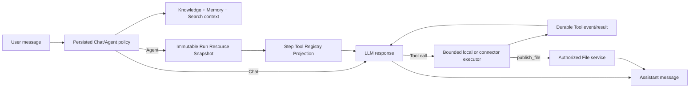
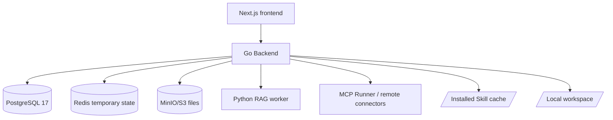

# Chat Agent Runtime Architecture

## Product boundary

Neo Chat has one conversation surface with two persisted runtime policies:

- **Chat** keeps Knowledge, Memory, Web Search, and normal model generation.
- **Agent** adds installed Skills, File, Terminal, background Job, Browser, MCP
  connectors, Goals, and explicit artifact publication.

The choice lives in `conversation.metadata.config.toolMode`. Missing historical
values map to Agent for compatibility. On an Auto-capability cache miss, Agent
waits for one shared bounded probe and enters the Tool Registry in that same
request when supported. Only confirmed inability to perform native Tool rounds
falls back to Chat; transient or inconclusive discovery preserves the native
adapter path without changing the stored user choice.

MCP is a connector implementation, not the Agent product. Users operate Tools
and connectors from their management surface; the composer does not expose MCP
preflight or protocol details.

## Runtime flow



The Backend is authoritative for Tool admission. Chat mode physically omits
Agent Tool definitions and skips Skill/MCP/Goal preparation. Agent mode freezes
the prepared MCP selection, installed Skill materialization, and Workspace
authority once per Run, then projects one immutable Tool Registry for each
Provider Step. First-Step retrieval, current MCP Tool-search visibility, and
loaded Skill state are part of that Step projection. Agent mode runs the
existing same-model continuation loop; it does not create Subagents.

## Containers and trust boundaries



`local_direct` commands run as the ordinary Backend UID/GID. The two explicit
binds are `/var/lib/mm-chat/agent-skills` and `/workspace`; the Backend image
provides Bash, Python/pip, Node/npm, Git, curl, jq, ripgrep, zip/unzip, and
`file`. Time, output, call, round, and concurrency bounds apply, and graceful
shutdown kills complete process groups.

This is **not a Sandbox**. There is no OCI Runner, per-Skill container, `sudo`,
container socket, Subagent, delegation, Canary, Scheduler, or autonomous
Learning control plane. Workspace contents and reachable networks have the
Backend user's authority, so secrets and unrelated host files stay outside the
bind.

## Skills, Assistants, and Tools

- `internal/agents` owns the Assistant library and prompt presets.
- `internal/skillsupply` owns Store discovery, admission, install, and uninstall
  through `/v1/skills/*`.
- `internal/localskills` materializes installed packages and executes bounded
  workspace operations.
- `internal/chat` owns the revisioned Runtime Resource Snapshot, derives the
  mode/Step-specific registry and Skill prompt from it, and runs the Tool loop.
- MCP remains an optional Tool/connector provider below that registry.

Resource descriptors and diagnostics stay Backend-internal for now. They carry
only stable hashed IDs, source/scope/status, revisions, contributed names, and
fixed diagnostic codes. They never contain credentials, Host/Skill paths,
Tool arguments/results, prompts, or raw errors. Existing Skill and MCP APIs
remain the only mutation authorities; there is no second resource database or
unified browser toggle.

The Skill Store is independent of the retired Agent Center. Installing a Skill
does not grant extra host identity or bypass Tool policy.

## Persistence and deliverables

Ordinary Agent execution is recorded in `chat_agent_turns`,
`chat_agent_events`, and `chat_agent_goals`. Files published with
`publish_file` enter the existing File service and object store, then appear as
permission-checked output attachments on the assistant message. Arbitrary local
paths are never exposed as download URLs.

Migrations `084`–`095` remain immutable history. Migration `098` removes their
disconnected tables, views, functions, and NOLOGIN roles only after every
legacy fact table is empty; it allows only the two migration-created singleton
state rows. The migration never names or mutates `chat_agent_*`, Skill, MCP,
Chat, Knowledge, Memory, or File objects.

## Verification

```bash
bash scripts/verify-agent-local-runtime.sh
bash scripts/verify-legacy-agent-cleanup-postgres17.sh
bash scripts/verify-chat-agent-event-log-postgres17.sh
bash scripts/verify-chat-agent-goals-postgres17.sh
bash scripts/verify-chat-artifacts-postgres17.sh
```
